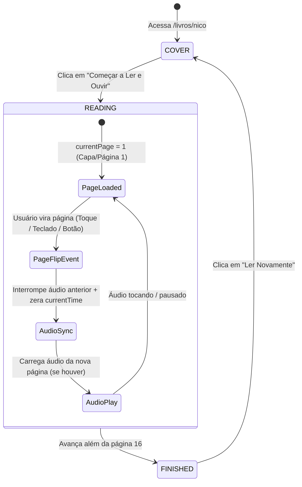

# Documentação de Arquitetura — Flipbook Narrado

**Versão:** 1.0  
**Stack:** React + TypeScript + Vite + StPageFlip (page-flip) + Vitest  

---

## 1. Visão Geral e Princípios Arquiteturais

A aplicação foi projetada com foco em:
1. **Desacoplamento Total de Conteúdo**: Nenhum componente React possui caminhos de arquivos, quantidade de páginas ou textos de livros codificados de forma estática. Todo o conteúdo é alimentado via manifestos JSON padronizados (`book.json`).
2. **Separação Rígida entre Áudio e Animação**: A biblioteca de física de flipbook (`page-flip`) é responsável exclusivamente pela renderização visual e gestos de virada. A engine de áudio (`AudioManager`) é 100% desacoplada e opera como fonte da verdade controlada pelo estado lógico (`currentPage`).
3. **Resiliência a Autoplay**: O navegador nunca inicia áudio antes da primeira interação explícita do usuário (botão "Começar"). Em caso de restrição ou falha de rede, a interface degrada suavemente para o estado `BLOCKED` ou `ERROR` sem travar a navegação do livro.
4. **Mobile-First & Acessibilidade**: A interface se adapta a smartphones (360px a 430px de largura) e telas de alta resolução, respeita preferências de `prefers-reduced-motion` e oferece navegação completa por teclado, botões com ARIA labels e controles de alto contraste.

---

## 2. Diagrama de Fluxo de Dados e Estados



---

## 3. Componentes Principais

### `BookReader` (`src/components/BookReader/BookReader.tsx`)
- Orquestra o ciclo de vida do livro (`COVER` ➔ `READING` ➔ `FINISHED`).
- Instancia e gerencia a biblioteca `PageFlip`.
- Escuta atalhos de teclado (Setas Esquerda/Direita para navegar, Espaço para play/pause).
- Sincroniza o estado reativo com a tela cheia e mudanças de orientação.

### `AudioManager` (`src/services/audioManager.ts`)
- P0: Centraliza o elemento de som HTML5 (`Audio`).
- Cancela requisições assíncronas concorrentes via `requestId` para evitar qualquer possibilidade de sobreposição sonora ao virar páginas com rapidez.
- Emite eventos reativos de progresso (`currentTime`, `duration`, `percentage`) e estados (`IDLE`, `LOADING`, `PLAYING`, `PAUSED`, `BLOCKED`, `ERROR`).

### `ReaderControls` (`src/components/ReaderControls/ReaderControls.tsx`)
- Barra de controle flutuante com suporte a acessibilidade:
  - Botão Página Anterior / Próxima (com desabilitação nos limites).
  - Botão Play / Pause com feedback visual e atalho.
  - Botão Reiniciar Narração.
  - Indicador `X / 16`.
  - Botão Mudo (Mute/Unmute).
  - Botão Tela Cheia (ocultado se não suportado pelo navegador).

---

## 4. Como Adicionar um Novo Livro

Para publicar uma nova obra sem alterar a engine:
1. Crie a pasta em `public/books/<slug-do-livro>/`.
2. Adicione as imagens em `public/books/<slug-do-livro>/pages/` (ex: `01.webp`, `02.webp`...).
3. Adicione as narrações em `public/books/<slug-do-livro>/audio/` (ex: `02.mp3`, `03.mp3`...).
4. Crie o arquivo `public/books/<slug-do-livro>/book.json` seguindo o schema `BookManifest`:

```json
{
  "slug": "o-dragao-azul",
  "title": "O Dragão Azul e a Estrela Guia",
  "description": "Uma aventura encantadora pelos céus.",
  "coverImage": "/books/o-dragao-azul/pages/01.webp",
  "totalPages": 16,
  "pages": [
    {
      "pageNumber": 1,
      "image": "/books/o-dragao-azul/pages/01.webp",
      "audio": null,
      "alt": "Capa do livro O Dragão Azul"
    },
    {
      "pageNumber": 2,
      "image": "/books/o-dragao-azul/pages/02.webp",
      "audio": "/books/o-dragao-azul/audio/02.mp3",
      "alt": "Página 2: O dragão acorda em sua caverna mágica"
    }
  ]
}
```
5. Registre o manifesto em `src/books/registry.ts`.
6. A rota `/livros/o-dragao-azul` estará instantaneamente funcional.

---

## 5. Guia de Manutenção e Testes

- **Adição de Novas Regras de Áudio**: Sempre adicione casos de teste em `tests/audioManager.test.ts` antes de alterar a classe `AudioManager`.
- **Execução dos Testes**:
  ```bash
  npm run test
  ```
- **Verificação de Tipos e Build**:
  ```bash
  npm run build
  ```
