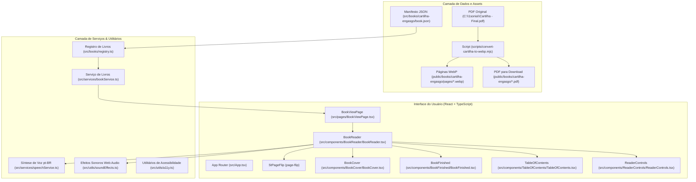

# Documentação Técnica: Flipbook da Cartilha "Engasgo em Idosos Durante as Refeições"

## 1. Visão Geral e Objetivo
Esta aplicação web transforma o material educativo em PDF **"Série Para Quem Cuida — Primeira Edição: Engasgo em Idosos Durante as Refeições"** (elaborada pela fonoaudióloga Sônia Torres, CRFa 1-17701) em uma experiência digital interativa no formato **Flipbook 3D realista**, altamente responsiva e enriquecida com recursos de acessibilidade para familiares e cuidadores de idosos.

---

## 2. Arquitetura do Sistema

---

## 3. Fluxo de Dados e Interações

1. **Carregamento Inicial**:
   - A rota padrão `/` redireciona para `/livros/cartilha-engasgo`.
   - `BookViewPage` busca o manifesto através de `getBookBySlug('cartilha-engasgo')`.
   - O `BookReader` é iniciado no modo `COVER` exibindo capa, subtítulo, dados da fonoaudióloga e botões de ação ("Abrir Cartilha Digital" e "Baixar PDF").

2. **Leitura e Virada de Páginas**:
   - Ao clicar em "Abrir Cartilha Digital", o modo transiciona para `READING` na página 1.
   - O motor `PageFlip` renderiza as páginas em proporção Retrato A5 (`420x595`), calculando o tamanho responsivo para desktop, tablet ou celular.
   - A cada virada física de folha (via swipe, clique nas setas ou laterais), o evento `flip` do StPageFlip é sincronizado com o estado do React (`currentPage`) e o gerador de som procedural (`soundEffects.playPageFlipSound()`) emite um ruído suave de papel folheado via Web Audio API.

3. **Acessibilidade e Narração em Voz Alta**:
   - Quando o cuidador clica no botão "Ouvir Leitura", o `speechService` utiliza a **Web Speech API** com voz em português do Brasil (`pt-BR`), lendo o conteúdo educativo detalhado da página atual.
   - Caso o cuidador mude de página, a fala é automaticamente interrompida para iniciar a nova página de forma limpa.

4. **Sumário e Miniaturas (Table of Contents)**:
   - Clicar no botão "Sumário" ou no indicador de página abre o menu lateral (`TableOfContents`).
   - Apresenta tanto a lista de tópicos agrupados por seções temáticas quanto a grade de miniaturas das 17 páginas.
   - O cuidador pode saltar diretamente para qualquer tópico (ex: "A posição correta", "Sinais de alerta", "Se a pessoa engasgar").

5. **Visualização Ampliada (Zoom)**:
   - Botão de lupa abre a modal de zoom com a imagem de alta definição (1440x2040) para leitura nítida das ilustrações anatômicas e de posicionamento.

6. **Conclusão e Reinício**:
   - Ao ultrapassar a página 17, a tela `BookFinished` é exibida com créditos, opção de compartilhamento do link, download do PDF e botão "Reler Cartilha" (que reinicia a leitura de forma limpa).

---

## 4. Estrutura dos Arquivos da Cartilha

| Arquivo | Função |
|---|---|
| `public/books/cartilha-engasgo/pages/*.webp` | 17 páginas em WebP de alta fidelidade (1440x2040) |
| `public/books/cartilha-engasgo/cartilha-engasgo-idosos.pdf` | Cópia do arquivo PDF original para download |
| `src/books/cartilha-engasgo/book.json` | Manifesto com metadados, títulos, seções e textos acessíveis |
| `src/books/registry.ts` | Registro central de obras disponíveis |
| `src/components/TableOfContents/` | Gaveta de sumário e miniaturas |
| `src/services/speechService.ts` | Gerenciador de fala em voz alta via Web Speech API |
| `src/utils/soundEffects.ts` | Sintetizador de efeito sonoro de virada de página |

---

## 5. Como Manter e Atualizar

- **Para atualizar o texto acessível ou tópicos**: Edite diretamente o arquivo `src/books/cartilha-engasgo/book.json`.
- **Para regerar as imagens caso o PDF seja alterado**: Execute `node scripts/convert-cartilha-to-webp.mjs`.
- **Para rodar a suíte de testes**: Execute `npm test`.
- **Para validar o build de produção**: Execute `npm run build`.
