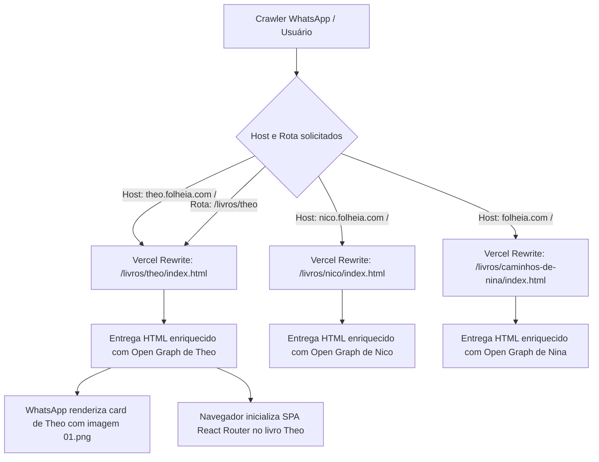

# Metadados Sociais e Open Graph por Livro / Domínio

Este documento descreve a arquitetura implementada para suporte a visualizações sociais (previews no WhatsApp, Telegram, Facebook, Twitter/X) dedicadas para cada livro e seus respectivos domínios (ex: `theo.folheia.com`, `nico.folheia.com`, `folheia.com`).

---

## 1. O Problema Resolvido

Em uma aplicação Single Page Application (SPA) baseada em Vite/React tradicional, existe apenas um `index.html` estático na raiz. 
Crawlers sociais (especialmente o do WhatsApp) **não executam JavaScript** ao gerar os cartões de preview (Open Graph). Portanto, ao compartilhar `https://theo.folheia.com` ou `https://theo.folheia.com/livros/theo`, o WhatsApp lia o `<title>` e as meta tags presentes diretamente no HTML bruto inicial entregue pelo servidor.

Anteriormente, o `index.html` continha metadados estáticos de "Os Caminhos de Nina", fazendo com que qualquer link de Theo aparecesse incorretamente como Nina no WhatsApp.

---

## 2. Arquitetura da Solução

Optou-se por uma arquitetura **100% estática e determinística**, sem necessidade de backend, CMS ou Edge Functions complexas:

1. **Geração Estática Pós-Build (`scripts/generate-book-htmls.mjs`)**:
   - Executa automaticamente após `vite build`.
   - Lê os manifestos oficiais dos livros em `src/books/*/book.json`.
   - Gera um arquivo `index.html` dedicado em `dist/livros/${slug}/index.html` para cada livro, contendo as tags Open Graph (`og:title`, `og:description`, `og:image`, `og:url`, `og:type`) e Twitter Cards.
   - Remove o `dist/index.html` físico genérico para evitar que o filesystem da Vercel ignore as regras de rewrites por subdomínio.

2. **Roteamento Declarativo na Vercel (`vercel.json`)**:
   - Regras de `rewrites` baseadas na chave `has: [{ "type": "host", "value": "..." }]`:
     - `theo.folheia.com/` → `/livros/theo/index.html`
     - `nico.folheia.com/` → `/livros/nico/index.html`
     - `/` (qualquer outro host, ex: `folheia.com`) → `/livros/caminhos-de-nina/index.html`
     - `/livros/theo` → `/livros/theo/index.html`
     - `/livros/nico` → `/livros/nico/index.html`
     - `/(.*)` (fallback SPA) → `/livros/caminhos-de-nina/index.html`
   - O leitor SPA continua carregando normalmente com seus scripts `/assets/...`, mas o HTML inicial recebido pelo crawler do WhatsApp contém os dados exatos do livro correspondente.

---

## 3. Fluxo de Dados



---

## 4. Como Manter e Adicionar Novos Livros

Para adicionar um novo livro com suporte a metadados Open Graph:

1. **Definir o manifesto**: Em `src/books/${slug}/book.json`, defina:
   - `slug`
   - `title`
   - `documentTitle`
   - `description`
   - `coverImage`

2. **Registrar no script de build**: No arquivo `scripts/generate-book-htmls.mjs`, adicione o novo livro na lista `booksMetadata`:
   ```javascript
   {
     slug: 'novo-livro',
     title: 'Título Oficial | Fonosuite',
     ogTitle: 'Título Oficial',
     description: novoManifest.description,
     canonicalUrl: 'https://folheia.com/livros/novo-livro',
     imageUrl: 'https://folheia.com/books/novo-livro/pages/01.png',
     imageWidth: 1448,
     imageHeight: 1086,
     imageType: 'image/png'
   }
   ```

3. **Se tiver subdomínio próprio**:
   - Adicione no `vercel.json` o rewrite condicional com `has: [{ "type": "host", "value": "novo-subdominio.folheia.com" }]`.
   - Adicione a rota no `src/utils/hostRouting.ts`.

4. **Validação**:
   - Execute `npm run test` (todos os testes em `tests/socialMetadata.test.ts` devem passar).
   - Execute `npm run build` e verifique `dist/livros/novo-livro/index.html`.
