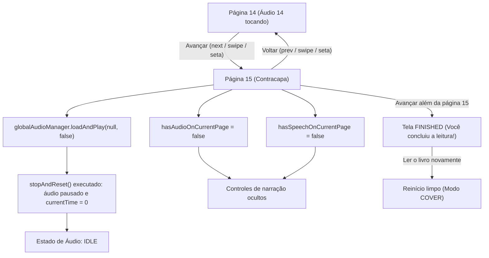

# Integração da Contracapa — Livro "Theo Tem uma História para Contar"

Este documento descreve a arquitetura, o fluxo de dados e os procedimentos de manutenção para a contracapa do livro digital ilustrado **"Theo Tem uma História para Contar"** (`slug: theo`), disponibilizado no leitor web narrado.


### 2.3 Atualização dos Telefones de Contato (Página 15)
- **Número anterior:** `(21) 98056-7699` (WhatsApp e Telefone)
- **Número atualizado oficial:** `(21) 97748-6801` (WhatsApp e Telefone)
- **Tipografia e Cor:** Poppins Bold 24px, cor `#072652`
- **Técnica de Preservação:** Interpolação horizontal contínua de linhas de fundo com @napi-rs/canvas, eliminando os números anteriores sem qualquer artefato ou desfoque no restante da arte original.
- **Script de automação:** `livro_theo_tem_uma_historia_pra_contar/scripts/update_contracapa.mjs`

---

## 1. Objetivo da Funcionalidade

Adicionar a imagem de encerramento da obra (contracapa) imediatamente após a página 14 narrativa, constituindo a página final (página 15) do livro.

Principais requisitos atendidos:
- **Posicionamento:** Aparece exclusivamente após a página 14 e encerra o livro.
- **Áudio:** A contracapa não possui narração ou gravação (`audio: null` e `speechText: null`).
- **Interrupção Atômica (P0):** Ao transicionar da página 14 para a contracapa, qualquer reprodução de áudio é parada imediatamente e nenhum novo som é iniciado.
- **Interface e Controles:** Botões exclusivos de reprodução sonora (*Ouvir*, *Ouvir novamente*, *Mute*, barra de progresso) ficam ocultos na contracapa.
- **Preservação Visual:** A proporção da ilustração é preservada integralmente via `object-fit: contain` sobre fundo neutro, sem cortes, distorções ou achatamento.
- **Navegação Bidirecional:** Permite avançar (14 → 15) e voltar (15 → 14) por botões, teclado (setas) e gestos de toque/swipe. Da página 15, o avanço conduz à tela de conclusão ("Você concluiu a leitura!"), com opção de reiniciar o livro.

---

## 2. Arquitetura e Ativos

### 2.1 Estrutura de Arquivos

```text
livro_theo_tem_uma_historia_pra_contar/
  assets/
    imagens/
      contracapa.png             # Arquivo-fonte original fornecido (1024x1536)

public/
  books/
    theo/
      pages/
        01.webp ... 14.webp       # Páginas narrativas otimizadas
        15.png                    # Cópia integral de preservação em alta fidelidade
        15.webp                   # Versão WebP otimizada (qualidade 90, 1024x1536)

src/
  books/
    theo/
      book.json                   # Manifesto oficial com totalPages: 15
  services/
    bookService.ts                # Regra de fallback para speechText === null
```

### 2.2 Especificações da Imagem
- **Arquivo-fonte:** `livro_theo_tem_uma_historia_pra_contar/assets/imagens/contracapa.png`
- **Formato:** PNG (1024 × 1536 px, RGB, ~2.3 MB)
- **Ativo WebP:** `public/books/theo/pages/15.webp` (303 KB, qualidade 90, effort 6)
- **Ativo PNG:** `public/books/theo/pages/15.png` (cópia idêntica byte a byte para preservação)

---

## 3. Fluxo de Dados e Estado



### 3.1 Representação no Manifesto (`book.json`)

```json
{
  "slug": "theo",
  "title": "Theo Tem uma História para Contar",
  "documentTitle": "Theo Tem uma História para Contar | Fonosuite",
  "coverImage": "/books/theo/pages/01.webp",
  "totalPages": 15,
  "pages": [
    ...
    {
      "pageNumber": 14,
      "image": "/books/theo/pages/14.webp",
      "audio": "/books/theo/audio/14.wav",
      "alt": "Theo junto da família em um momento afetivo e tranquilo, encerrando a história.",
      "title": "Página 14",
      "speechText": "Theo ainda tinha muitas histórias para contar..."
    },
    {
      "pageNumber": 15,
      "image": "/books/theo/pages/15.webp",
      "audio": null,
      "alt": "Contracapa do livro Theo Tem uma História para Contar",
      "title": "Contracapa",
      "speechText": null
    }
  ]
}
```

### 3.2 Isolamento de Síntese de Voz (`bookService.ts`)

Para evitar que uma página sem áudio utilize acidentalmente o texto do atributo `alt` como narração por voz no navegador, o serviço `bookService.ts` verifica explicitamente:

```ts
export function getPageSpeechText(manifest: BookManifest, pageNumber: number): string | null {
  if (pageNumber < 1 || pageNumber > manifest.pages.length) {
    return null;
  }
  const page = manifest.pages[pageNumber - 1];
  if (page.speechText === null) {
    return null;
  }
  return page.speechText || page.alt || page.title || null;
}
```

Dessa forma, definir `"speechText": null` garante que `hasSpeechOnCurrentPage` seja falso e que nenhum botão de síntese de voz seja exibido.

---

## 4. Como Manter e Atualizar

1. **Substituição da Imagem da Contracapa:**
   - Adicione o novo arquivo em `livro_theo_tem_uma_historia_pra_contar/assets/imagens/contracapa.png`.
   - Execute o script `scripts/setup-theo.mjs` via `node scripts/setup-theo.mjs` ou gere o WebP com Sharp.
2. **Execução de Testes Automatizados:**
   - Execute `npm test` para validar a suite completa (74 testes cobrindo áudio, transição bidirecional, navegação e manifesto).
3. **Validação de Build:**
   - Execute `npm run build` para garantir TypeScript, compilação Vite e injeção de metadados estáticos para SEO.
